# EEG Motor Imagery Classification with Quantum Genetic Algorithm Feature Selection

Full pipeline for 3-class motor imagery EEG classification
(left hand, right hand, rest) based on Filter Bank Common Spatial Patterns (FBCSP)
with feature subset selection by Quantum Genetic Algorithm (QGA).

## Key Findings

- **76.92% test accuracy** and **0.6476 macro F1** on PhysioNetMI Subject 1
- QGA selects **7 of 12 FBCSP features** but beats the performance of the full 12-features baseline
- No leaks: CSP, scikit-learn scaler, and QGA fitness are fitted exclusively on the training set
- Rigorous statistics: McNemar's test and bootstrap 95% confidence intervals provided
- Gradio interactive demo with balanced sampling and manually entered EEG

## Architecture

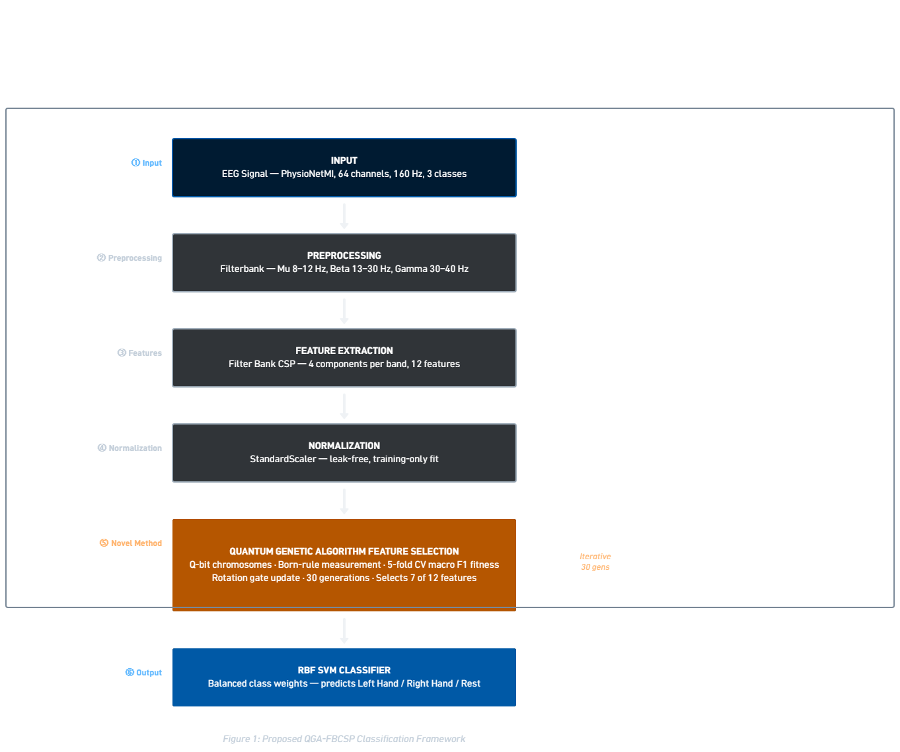

**Architecture summary:**

1. Raw EEG from PhysioNetMI Subject 1 (64 channels, 160 Hz, 4 sec trials)
2. Three-band Butterworth filter bank: Mu (8-12 Hz), Beta (13-30 Hz), Gamma (30-40 Hz)
3. Filter Bank CSP: 4 components for each band => 12 features per trial
4. StandardScaler fit on train fold alone (no leakage)
5. **Quantum Genetic Algorithm** determines the optimal subset (new addition to the literature)
6. Balanced RBF SVM classifier for left hand, right hand, or rest

## Dataset

**PhysioNet EEG Motor Movement/Imagery Dataset (eegmmidb), version 1.0.0**

- URL: https://physionet.org/content/eegmmidb/1.0.0/
- DOI: https://doi.org/10.13026/C28G6P
- Accessed via MOABB: `moabb.datasets.PhysionetMI`
- Subject 1, 3 classes (left hand, right hand, rest)
- 129 trials, 64 EEG channels, 160 Hz sampling rate

**Citation:**

Schalk, G. (2009). *EEG Motor Movement/Imagery Dataset* (version 1.0.0). PhysioNet. RRID:SCR_007345. https://doi.org/10.13026/C28G6P
## Results

| Algorithm | Accuracy on test set | Test Macro-F1 | Cross validation macro-F1 |
|---|---|---|---|
| Majority class baseline | 0.6538 | — | — |
| Fully functional FBCSP (12 features) + SVM | 0.7308 | 0.6245 | 0.8983 |
| **QGA selected (7 features) + SVM** | **0.7692** | **0.6476** | **0.9522** |

**Indices of selected features:** [1, 2, 4, 6, 7, 8, 9]

### Comparison Chart

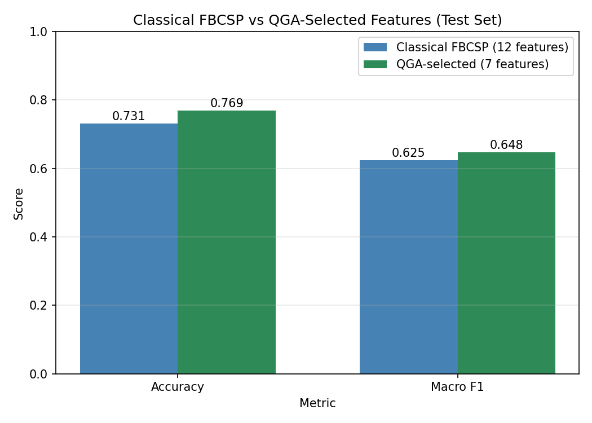

### Confusion Matrices

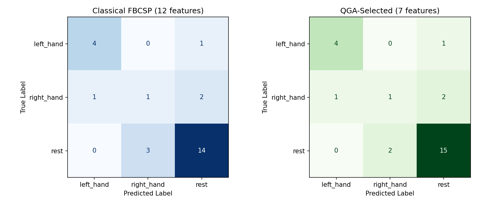


## Novelty

- Application of QGA to **components of FBCSP** (not channel selection, not raw features)
- Filterbank using three bands creating a 12-dimensional representation in space and frequency
- Fully leak-proof pre-processing and evaluation procedure
- Transparent statistics (McNemar p = 1.0000, overlapping bootstrap confidence intervals)
- Demo application using balanced classes and user interface

## Demo

The Gradio interface supports pre-staged test sample evaluation and manual EEG trial upload.

### Left Hand Predictions

Correct classifications:
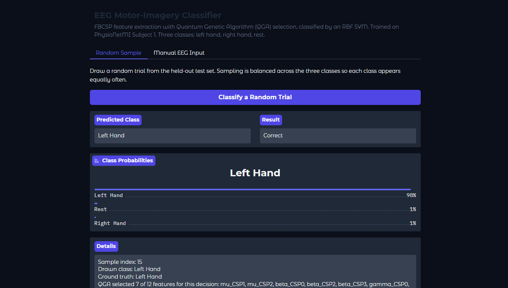
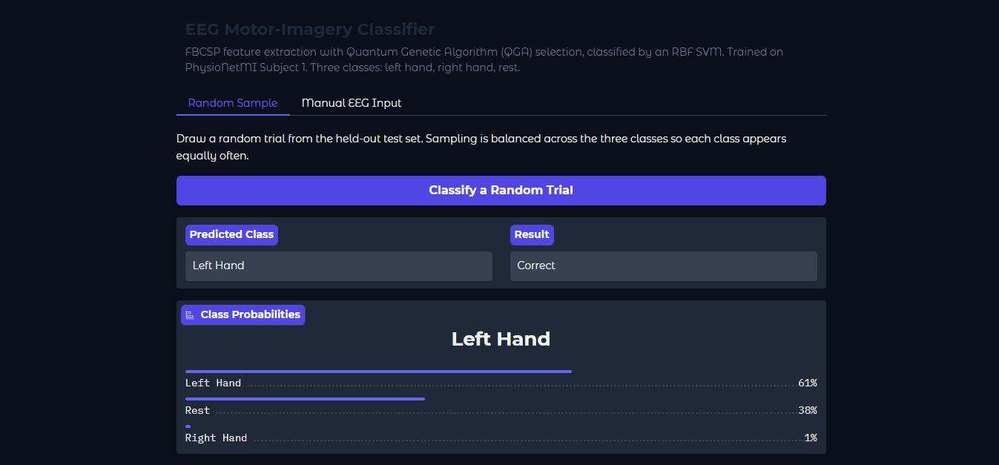

Incorrect classification :
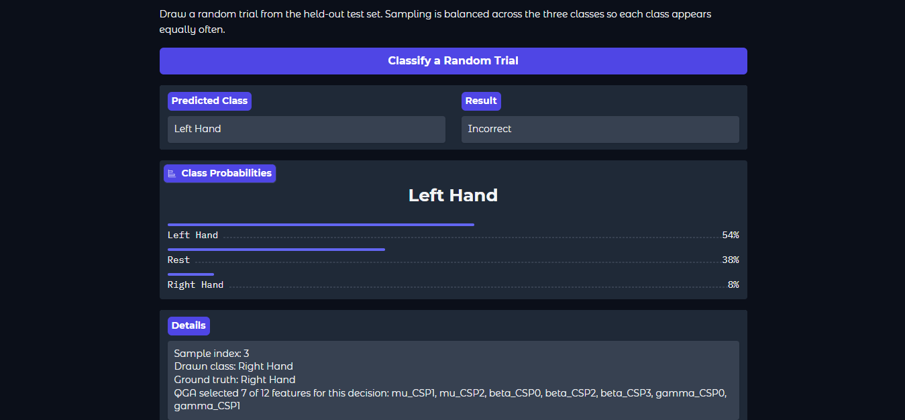

### Right Hand Predictions

Correct classifications:
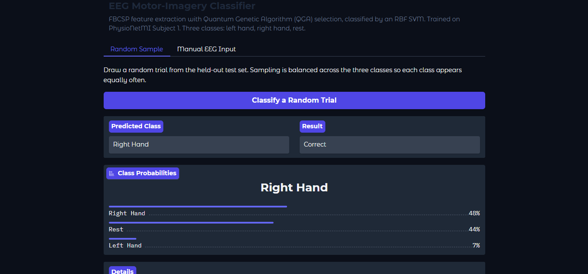
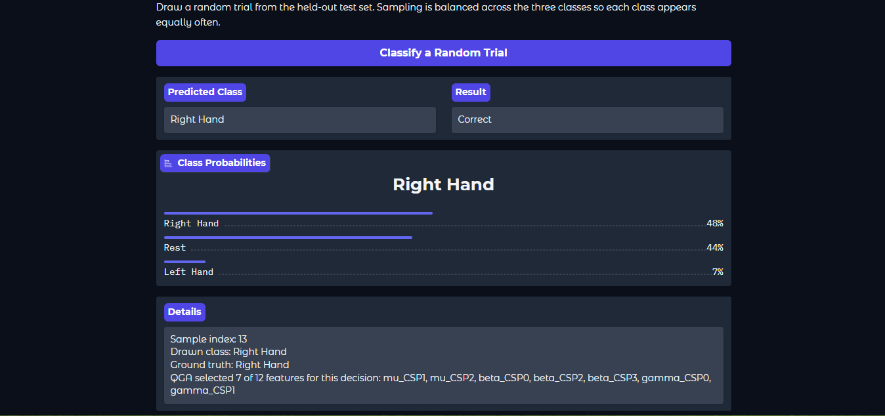

Incorrect classification :
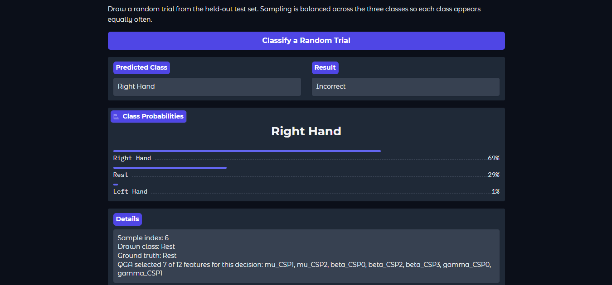

### Rest Predictions

Correct classifications:
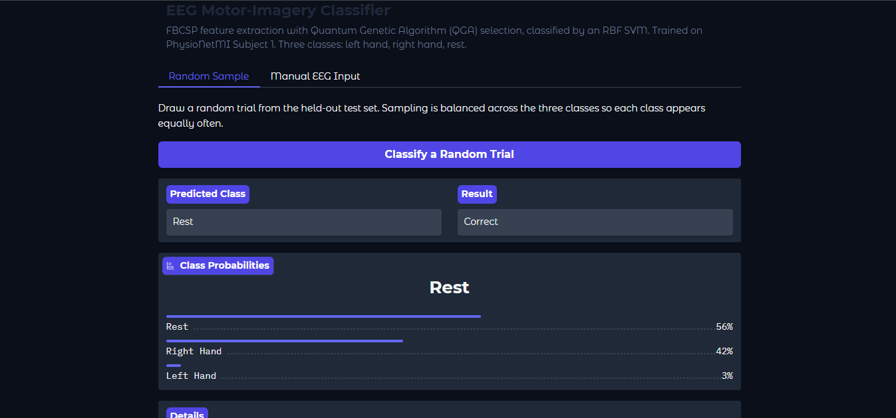
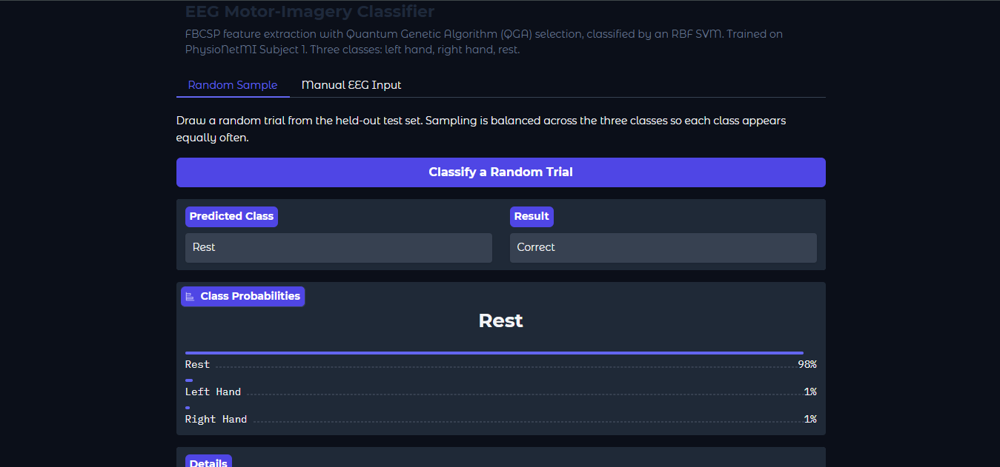

Incorrect classification:
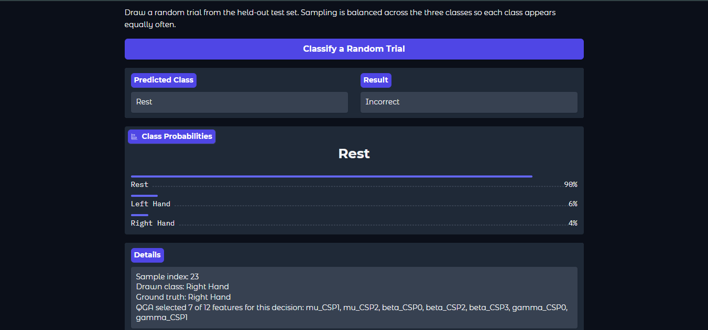
### Manual EEG Input Tab

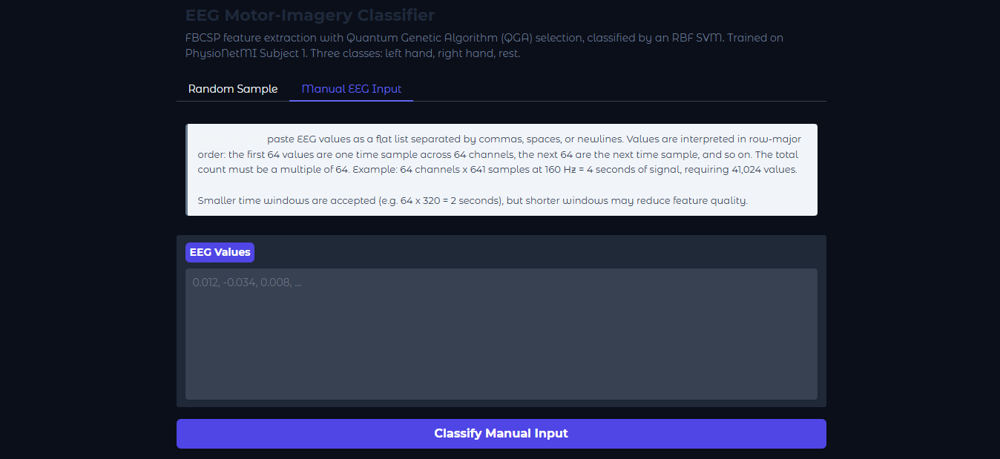


## Installation

### Option 1: Run in Google Colab (Recommended)

1. Download the notebook from [notebooks/QGA_for_FBCSP_feature_selection_Final.ipynb](notebooks/QGA_for_FBCSP_feature_selection_Final.ipynb)
2. Go to [Google Colab](https://colab.research.google.com)
3. Click **File → Upload notebook** and select the downloaded file
4. When prompted, click **Mount Google Drive**
5. Run the cells in order: Cell 1 → Cell 2 → ... → Cell 8
6. Cell 4 (QGA feature selection) takes 4–6 minutes
7. Cell 8 launches the Gradio demo with a public URL

### Option 2: Run Locally

1. Clone the repository:
   ```bash
   git clone https://github.com/sharan-yan04/EEG_Classifier.git
   cd EEG_Classifier
2. Run the cells 
3. Verify the results and check out our UI
